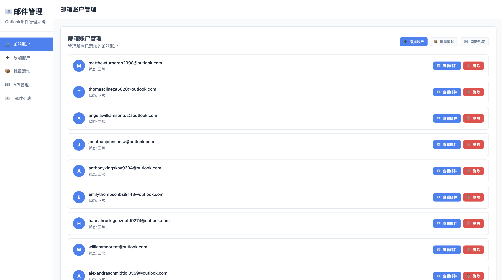
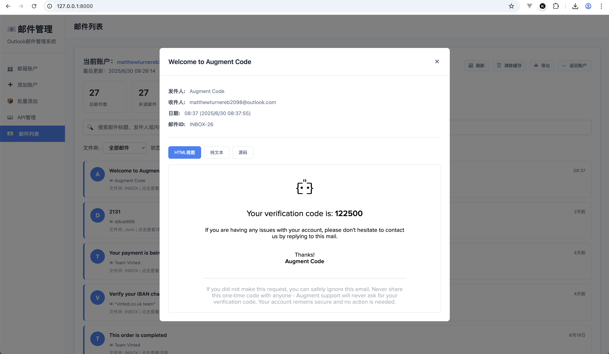
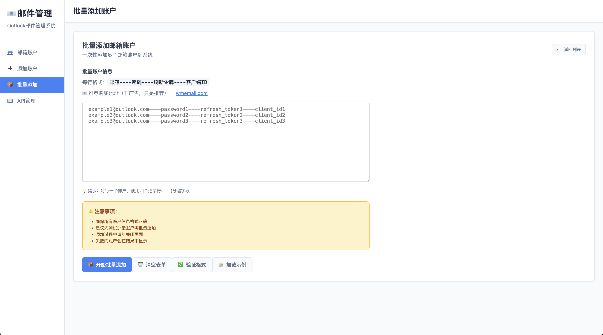
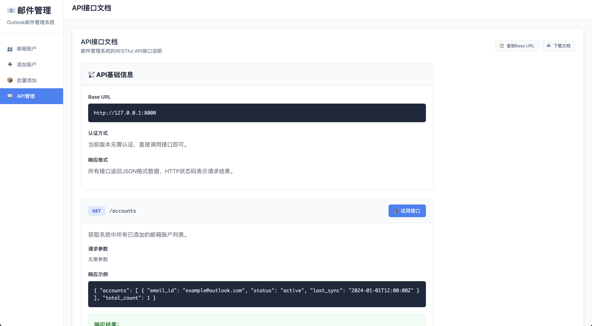

# 📧 Outlook邮件管理系统

一个基于FastAPI和现代Web技术构建的Outlook邮件管理系统，支持多账户管理、邮件查看、搜索过滤等功能。

## ✨ 功能特性

### 🏠 主要功能
- **📧 邮件管理**: 支持查看、搜索、过滤邮件
- **👥 多账户管理**: 支持添加和管理多个Outlook邮箱账户
- **📦 批量操作**: 支持批量添加邮箱账户
- **🔍 智能搜索**: 实时搜索邮件标题、发件人等信息
- **📊 数据统计**: 显示邮件统计信息（总数、未读、今日邮件等）
- **📤 数据导出**: 支持导出邮件列表为CSV格式
- **🚀 高性能**: 连接池优化、智能缓存、批量处理
- **📖 API文档**: 完整的RESTful API接口文档

### 🔧 技术特性
- **🏗️ 现代架构**: FastAPI + HTML5 + CSS3 + JavaScript
- **⚡ 高性能**: IMAP连接池、智能缓存机制
- **🎯 用户友好**: 响应式设计、实时通知、键盘快捷键
- **🔒 安全可靠**: OAuth2认证、错误处理、连接管理
- **📱 移动适配**: 支持移动设备访问
- **🌐 RESTful API**: 标准化API接口设计

## 🚀 快速开始

### 🎯 选择您的使用方式

根据您的需求选择合适的启动方式：

| 用户类型 | 推荐方式 | 适用场景 |
|---------|---------|---------|
| **👤 普通用户** | Docker一键启动 | 快速体验、日常使用 |
| **👨‍💻 开发者** | [开发者指南](docs/development.md) | 代码开发、功能调试、系统定制 |

### 👤 普通用户 - Docker一键启动

#### 📋 系统要求
- Docker & Docker Compose
- PostgreSQL数据库
- 现代浏览器（Chrome、Firefox、Safari、Edge）
- 网络连接（用于访问Outlook IMAP服务器）

#### 🚀 一键启动
```bash
# 克隆项目
git clone <repository-url>
cd OutlookManager

# 启动应用服务（连接到PostgreSQL数据库）
docker-compose up -d
```

系统会自动：
- 创建并启动Outlook邮件管理服务
- 连接到您已配置的PostgreSQL数据库
- 配置所有必要的默认参数

#### 🌐 访问系统
启动成功后，在浏览器中访问：
- **Web界面**: http://localhost:8000
- **API文档**: http://localhost:8000/docs
- **API状态**: http://localhost:8000/api

**默认登录信息**：
- 用户名：`admin`
- 密码：`admin`

#### 📋 查看服务状态
```bash
# 查看服务状态
docker-compose ps

# 查看日志
docker-compose logs -f outlook-email-client
```

### 👨‍💻 开发者
如果您是开发者，需要修改代码、调试功能或进行系统定制，请参考详细的[开发者指南](docs/development.md)。

## 📚 使用指南

### 1️⃣ 添加邮箱账户
1. 点击左侧菜单"添加账户"
2. 填写邮箱地址、刷新令牌和客户端ID
3. 点击"测试连接"验证配置
4. 点击"添加账户"完成添加

### 2️⃣ 查看邮件
1. 在账户列表中点击"查看邮件"
2. 使用搜索框查找特定邮件
3. 使用过滤器按条件筛选
4. 点击邮件查看详细内容

### 3️⃣ 批量添加账户
1. 点击左侧菜单"批量添加"
2. 按格式输入账户信息：`邮箱----密码----刷新令牌----客户端ID`
3. 点击"验证格式"检查数据
4. 点击"开始批量添加"执行

### 4️⃣ API调用
查看"API管理"页面获取完整的接口文档，支持：
- 获取邮箱列表：`GET /accounts`
- 获取邮件列表：`GET /emails/{email_id}`
- 获取邮件详情：`GET /emails/{email_id}/{message_id}`

## 📖 详细文档

我们提供了完整的文档中心，帮助您更好地使用和定制系统：

### 📋 安装与配置
- [📦 安装指南](docs/installation.md) - 详细的系统安装步骤
- [⚙️ 配置指南](docs/configuration.md) - 完整的配置选项说明

### 👨‍💻 开发与部署
- [🛠️ 开发者指南](docs/development.md) - 开发环境搭建和代码贡献
- [🚀 部署指南](docs/deployment.md) - 生产环境部署方案

### 📚 使用与支持
- [📖 账户同步使用指南](docs/account_sync_usage.md) - 账户同步功能详细说明
- [🗄️ PostgreSQL设置](docs/postgresql-setup.md) - 数据库配置指南
- [🔧 故障排除指南](docs/troubleshooting.md) - 常见问题解决方案

### 📋 文档导航
- [📚 文档中心](docs/README.md) - 完整的文档导航和索引

## 🎨 用户界面

### 邮件列表界面

*邮件列表页面，支持搜索、过滤和统计功能*

### 邮箱账户管理


*邮箱账户管理页面，支持添加、删除和查看邮箱状态*

### API接口文档

*完整的API接口文档，支持在线测试*

## 📞 支持与反馈

- **问题报告**: 请在GitHub Issues中提交
- **功能建议**: 欢迎提交Pull Request
- **技术支持**: 查看API文档或联系开发团队

---

**🎉 感谢使用Outlook邮件管理系统！**

如需更多帮助，请查看我们的[完整文档中心](docs/README.md)。